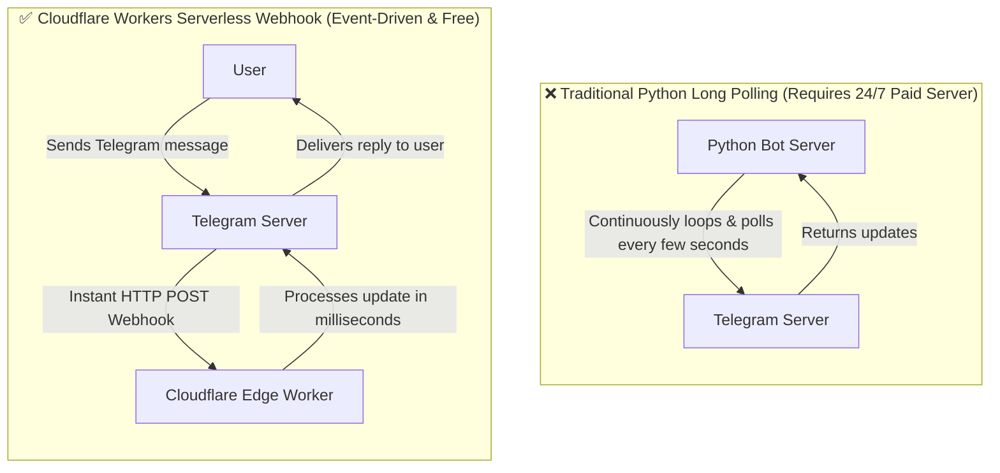

# 📖 Tutorial: Convert a Python Telegram Bot to TypeScript & Host for Free on Cloudflare Workers

[](https://workers.cloudflare.com/)
[](https://www.typescriptlang.org/)
[](https://core.telegram.org/bots/api)
[](https://workers.cloudflare.com/)
[](https://opensource.org/licenses/MIT)

> A comprehensive, beginner-friendly guide and production-ready starter template for migrating your existing Python Telegram bot (polling or webhook) to **TypeScript** running serverless on **Cloudflare Workers**.
> 
> Say goodbye to paying $5–$20/month for a VPS or managing crashing server processes — get **0ms cold start latency**, automatic global scaling, and **100,000 requests/day for free**.

---

## ⚡ Why Migrate from Python to Cloudflare Workers?

| Feature | Traditional Python Bot (VPS / Heroku / EC2) | Cloudflare Workers + TypeScript |
| :--- | :--- | :--- |
| **Hosting Cost** | $5 – $25/month for VPS | **$0.00 / Free Tier** (100,000 requests/day) |
| **Delivery Model** | Long Polling (`run_polling()`) | Ultra-fast Serverless Webhook |
| **Server Maintenance**| Linux patches, memory leaks, PM2, Docker | **Zero Maintenance** (Fully managed by Cloudflare) |
| **Cold Starts** | 1–5 seconds process boot | **0ms cold start** (V8 isolates) |
| **Global Latency** | Single datacenter location | Deployed across 300+ edge cities worldwide |
| **Crash Recovery** | Bot dies if uncaught exception occurs | Each request is an isolated worker event |

---

## 🔄 Architecture: Long Polling vs Edge Webhooks

Most Python bots built using libraries like `python-telegram-bot` or `telebot` use **Long Polling**. This requires a process running 24/7 on a server constantly asking Telegram: *"Do you have new messages?"*.

Cloudflare Workers use **Webhooks**, which are push notifications sent by Telegram whenever an event occurs:



---

## 📂 Project Overview & Structure

This repository uses a clean, beginner-friendly single-file architecture with zero unnecessary complexity:

```text
telegram-bot-cloudflare-worker/
├── index.ts              # All-in-one TypeScript bot (types, helpers, commands & webhook)
├── .dev.vars.example     # Template for local environment secrets
├── .gitignore            # Files excluded from git tracking
├── package.json          # Project scripts, types & dependencies
├── tsconfig.json         # TypeScript compiler settings
├── wrangler.jsonc        # Cloudflare Wrangler configuration
├── README.md             # Complete tutorial & handbook
└── LICENSE               # MIT License
```

---

## 🚀 Step-by-Step Tutorial

### Step 1: Prerequisites

Before you start, make sure you have:
1. **Node.js (v18+)** installed. Verify in your terminal:
   ```bash
   node -v
   npm -v
   ```
2. A free **Cloudflare Account**: [Sign up here](https://dash.cloudflare.com/sign-up).
3. A **Telegram Bot Token**:
   * Open Telegram and search for [@BotFather](https://t.me/BotFather).
   * Send `/newbot` and follow the prompts to get your bot token (e.g., `123456789:ABCdefGHIjkl...`).

---

### Step 2: Clone or Initialize the Project

#### Option A: Clone this starter template (Fastest)
```bash
git clone https://github.com/SahasGamageX/telegram-bot-cloudflare-worker.git
cd telegram-bot-cloudflare-worker
npm install
```

#### Option B: Create from scratch using Cloudflare C3
If you prefer starting completely from scratch:
```bash
npm create cloudflare@latest my-bot -- --type=hello-world --ts
cd my-bot
npm install -D @cloudflare/workers-types
```

---

### Step 3: Understanding the TypeScript Code

In Python, your bot might look like this:
```python
# Python: bot.py
async def start(update, context):
    await update.message.reply_text("Hello from Python!")
```

In TypeScript on Cloudflare Workers, we handle incoming requests inside the `fetch` handler:

```typescript
// src/index.ts
export default {
  async fetch(request: Request, env: Env): Promise<Response> {
    // Only accept POST requests from Telegram
    if (request.method !== "POST") {
      return new Response("Bot is active and running.", { status: 200 });
    }

    const update = await request.json();

    if (update.message?.text === "/start") {
      await sendMessage(env, update.message.chat.id, "Hello from TypeScript!");
    }

    return new Response("OK", { status: 200 });
  }
};
```

---

### Step 4: Setting Up Secrets & Local Testing

Never hardcode your bot token in code!

1. Copy the example environment file:
   ```bash
   cp .dev.vars.example .dev.vars
   ```
2. Fill in your credentials inside `.dev.vars`:
   ```env
   BOT_TOKEN="123456789:ABCdefGHIjklMNOpqrsTUVwxyz"
   WEBHOOK_SECRET="my_random_secret_token_123"
   ```
3. Start the local worker emulator:
   ```bash
   npm run dev
   ```
4. **How to test locally:**
   Because Telegram cannot send webhooks directly to `http://localhost:8787`, you can test your worker logic locally using `curl`:
   ```bash
   curl -X POST http://127.0.0.1:8787 \
     -H "Content-Type: application/json" \
     -H "X-Telegram-Bot-Api-Secret-Token: my_random_secret_token_123" \
     -d '{"update_id":1,"message":{"chat":{"id":123456789},"text":"/start"}}'
   ```
   If configured properly, your Telegram account will receive the `/start` message!

---

### Step 5: Deploying to Cloudflare Workers

1. Log in to Wrangler from your terminal:
   ```bash
   npx wrangler login
   ```
   *(A browser window will open — click **Authorize**).*

2. Upload your bot secrets to Cloudflare's encrypted key-value store:
   ```bash
   npx wrangler secret put BOT_TOKEN
   npx wrangler secret put WEBHOOK_SECRET
   ```
   *(Paste your respective values when prompted).*

3. Deploy your code:
   ```bash
   npm run deploy
   ```

Wrangler will output your live public Worker URL:
```text
https://telegram-bot-cloudflare-worker.<your-subdomain>.workers.dev
```

---

### Step 6: Setting Up the Telegram Webhook

Now notify Telegram to deliver incoming messages to your Cloudflare Worker URL.

Run this `curl` command (replace placeholders with your real values):

```bash
curl -F "url=https://telegram-bot-cloudflare-worker.<your-subdomain>.workers.dev" \
     -F "secret_token=YOUR_WEBHOOK_SECRET" \
     https://api.telegram.org/botYOUR_BOT_TOKEN/setWebhook
```

You should receive a JSON response confirming:
```json
{"ok":true,"result":true,"description":"Webhook was set"}
```

> 🔒 **Why use `secret_token`?**
> Anyone who discovers your Cloudflare Worker URL could theoretically send fake requests to it. By providing a `secret_token`, Telegram will send an `X-Telegram-Bot-Api-Secret-Token` header on every call. Your Worker verifies this header, instantly dropping unauthorized spam!

---

### Step 7: Verifying & Debugging with Live Logs

#### 1. Check Webhook Info
Verify that Telegram has zero pending updates and no errors:
```bash
curl https://api.telegram.org/botYOUR_BOT_TOKEN/getWebhookInfo
```

#### 2. Stream Live Logs
To see incoming requests and debug in real-time while chatting with your bot:
```bash
npm run tail
```
*(Runs `wrangler tail` to stream logs directly to your console).*

---

## 🐍 Python vs. TypeScript Code Comparison

### 1. Simple Commands (`/start`, `/ping`)

#### Python (`python-telegram-bot`):
```python
from telegram import Update
from telegram.ext import ContextTypes

async def start(update: Update, context: ContextTypes.DEFAULT_TYPE):
    await update.message.reply_text("👋 Hello from Python!")
```

#### TypeScript (Cloudflare Worker):
```typescript
import { Env } from "./types";
import { sendMessage } from "./telegram";

export async function handleStart(chatId: number, env: Env) {
  await sendMessage(env, chatId, "👋 Hello from TypeScript on Cloudflare Workers!");
}
```

---

### 2. Inline Keyboards & Buttons

#### Python:
```python
from telegram import InlineKeyboardButton, InlineKeyboardMarkup

keyboard = [
    [InlineKeyboardButton("🌐 Website", url="https://example.com")],
    [InlineKeyboardButton("⚡ Click Me", callback_data="btn_clicked")]
]
reply_markup = InlineKeyboardMarkup(keyboard)
await update.message.reply_text("Please choose:", reply_markup=reply_markup)
```

#### TypeScript:
```typescript
import { sendMessage } from "./telegram";

await sendMessage(env, chatId, "Please choose an option:", {
  reply_markup: {
    inline_keyboard: [
      [{ text: "🌐 Website", url: "https://example.com" }],
      [{ text: "⚡ Click Me", callback_data: "btn_clicked" }]
    ]
  }
});
```

---

### 3. Callback Queries (Button Clicks)

When a user clicks an inline button, Telegram displays a loading spinner on the button until you call `answerCallbackQuery`.

#### Python:
```python
async def button_handler(update: Update, context: ContextTypes.DEFAULT_TYPE):
    query = update.callback_query
    await query.answer(text="Button was clicked!", show_alert=False)
```

#### TypeScript:
```typescript
import { answerCallbackQuery } from "./telegram";

export async function handleCallback(callbackQuery: TelegramCallbackQuery, env: Env) {
  await answerCallbackQuery(env, callbackQuery.id, {
    text: "Button was clicked!",
    show_alert: false
  });
}
```

---

### 4. Sending Photos & Media

#### TypeScript:
```typescript
export async function sendPhoto(env: Env, chatId: number, photoUrl: string, caption?: string) {
  await fetch(`https://api.telegram.org/bot${env.BOT_TOKEN}/sendPhoto`, {
    method: "POST",
    headers: { "Content-Type": "application/json" },
    body: JSON.stringify({
      chat_id: chatId,
      photo: photoUrl,
      caption: caption,
      parse_mode: "HTML"
    })
  });
}
```

---

## 🗄️ Database & State Migration

In traditional Python scripts, you might have used **SQLite** (`bot.db`) or kept state in memory (`user_steps = {}`). 

Because Workers run across a decentralized network, local disk storage is not available. Here are the best free alternatives:

### 1. Cloudflare KV (Key-Value Storage)
Ideal for user sessions, simple state tracking, and rate limiting:
```bash
npx wrangler kv:namespace create BOT_KV
```
Usage in TypeScript:
```typescript
// Save user step
await env.BOT_KV.put(`user:${chatId}:step`, "awaiting_name");

// Read user step
const step = await env.BOT_KV.get(`user:${chatId}:step`);
```

### 2. Cloudflare D1 (Serverless SQLite)
If your Python bot used SQLite tables, **Cloudflare D1** is a drop-in relational SQL database with a generous free tier:
```bash
npx wrangler d1 create bot-database
```
Usage in TypeScript:
```typescript
const { results } = await env.DB.prepare(
  "SELECT * FROM users WHERE telegram_id = ?"
).bind(chatId).all();
```

---

## ⚠️ 5 Critical Gotchas for Python Developers

### 1. In-Memory Variables Do NOT Persist!
* **Trap:** In Python, you could create a global dictionary: `sessions = {}`.
* **Workers Reality:** Cloudflare Workers are ephemeral. Instances spin up and down constantly across 300+ cities. Global RAM variables will get wiped. Always persist data in **Cloudflare KV** or **D1**.

### 2. The 5-Second Telegram Timeout Rule
* **Trap:** If your bot does slow tasks (e.g., calling OpenAI, scraping a website, or generating images), Telegram expects a `200 OK` response within 5 seconds. If delayed, Telegram assumes the webhook failed and **retries sending the same message repeatedly**, causing duplicates.
* **Solution:** Return `200 OK` immediately and let background work continue using `ctx.waitUntil()`:
  ```typescript
  export default {
    async fetch(request: Request, env: Env, ctx: ExecutionContext): Promise<Response> {
      const update = await request.json();
      
      // Run slow background tasks without blocking response
      ctx.waitUntil(processSlowTask(update, env));

      return new Response("OK", { status: 200 });
    }
  };
  ```

### 3. CPU Time vs Execution Limits
* Cloudflare Free Tier gives you **up to 10ms–50ms CPU execution time**.
* Waiting for external network requests (like calling `fetch(https://api.telegram.org/...)` or an external API) is classified as I/O wait time and **does NOT count** against your CPU time limit.

### 4. How to Switch Back to Polling (If Ever Needed)
If you ever want to run your bot locally via Python polling again, remember to delete the active webhook:
```bash
curl https://api.telegram.org/botYOUR_BOT_TOKEN/deleteWebhook
```

### 5. Need a Full Framework? Check Out `grammY`
For large bots with hundreds of commands, deep conversation trees, and complex plugins, you can use **[grammY](https://grammy.dev)** — the modern TypeScript Telegram Bot framework with official first-class support for Cloudflare Workers.

---

## 🤝 Contributing & Feedback

Contributions, suggestions, and improvements are welcome!
- Found a bug? Open an **Issue**.
- Want to add a new example? Submit a **Pull Request**.
- If this guide helped you, please give it a **⭐ Star** on GitHub to help others find it!

---

## 📄 License

This tutorial and template are open source and licensed under the [MIT License](LICENSE).
Feel free to use it for personal or commercial bots!
