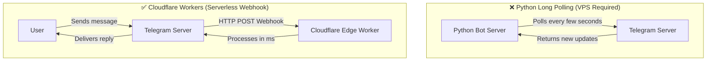

# 🚀 Convert Python Telegram Bot to TypeScript on Cloudflare Workers

[](https://workers.cloudflare.com/)
[](https://www.typescriptlang.org/)
[](https://core.telegram.org/bots/api)
[](https://opensource.org/licenses/MIT)

A complete step‑by‑step guide and template to migrate your existing Python Telegram bot (polling or webhook) to **TypeScript** running serverless on **Cloudflare Workers** with zero cold starts, global edge latency, and free‑tier hosting.

---

## ⚡ Overview

Migrating a bot from Python to TypeScript on Cloudflare Workers is a **code rewrite** combined with an **infrastructure modernization**:

| Feature | Legacy Python Setup | Cloudflare Workers + TypeScript |
| :--- | :--- | :--- |
| **Runtime** | Python 3.x (VPS / Heroku / EC2) | V8 Engine / Web Standards |
| **Update Delivery** | Long Polling (`run_polling()`) | Fast Webhook via Edge Nodes |
| **Server Cost** | $5 – $20+/month VPS | Free (Up to 100 k req/day) |
| **Scaling** | Manual / Process Managers (PM2/Systemd) | Automatic Instant Global Scaling |
| **Maintenance** | OS updates, security patches, crashes | Fully Serverless & Zero‑maintenance |

---

## 🔄 Key Architecture Difference: Polling vs Webhook

Most Python bots built with `python‑telegram‑bot` or `telebot` use **Long Polling**, which holds open connections. Cloudflare Workers are event‑driven and **require Webhooks**:



---

## 📋 Prerequisites

1. **Node.js** (v18+). Verify:
   ```bash
   node -v
   npm -v
   ```
2. A **Cloudflare** account (free tier works).
3. A **Telegram Bot Token** from @BotFather.
4. A random string for `WEBHOOK_SECRET` (used to verify incoming webhook calls).

---

## 📂 Project Directory Structure

```text
my-telegram-bot/
├── .github/
│   └── workflows/
│       └── deploy.yml          # CI/CD via GitHub Actions
├── src/
│   ├── handlers/
│   │   ├── commands.ts         # /start, /help, etc.
│   │   └── callbacks.ts        # Inline‑keyboard callbacks
│   ├── types.ts                # Telegram update types & Env interface
│   └── index.ts                # Worker entry point (fetch handler)
├── .gitignore
├── package.json
├── tsconfig.json
├── wrangler.jsonc              # Cloudflare configuration
└── README.md
```

---

## 1. Initialise Cloudflare Worker

```bash
npm create cloudflare@latest my-telegram-bot -- --type=hello-world --ts
cd my-telegram-bot
```

Optionally install helpful typings:
```bash
npm install -D @types/node
```

---

## 2. Python vs TypeScript Code Comparison

### Handling `/start`
**Python (`python‑telegram‑bot`):**
```python
from telegram import Update
from telegram.ext import ContextTypes

async def start(update: Update, context: ContextTypes.DEFAULT_TYPE):
    await update.message.reply_text("Hello from Python!")
```

**TypeScript (Cloudflare Worker):**
```typescript
import { Env } from "./types";

export async function handleStart(chatId: number, env: Env) {
  const url = `https://api.telegram.org/bot${env.BOT_TOKEN}/sendMessage`;
  await fetch(url, {
    method: "POST",
    headers: { "Content-Type": "application/json" },
    body: JSON.stringify({
      chat_id: chatId,
      text: "👋 Hello from TypeScript on Cloudflare Workers!",
      parse_mode: "HTML"
    })
  });
}
```

### Sending Inline Keyboard Buttons
```typescript
export async function sendMenu(chatId: number, env: Env) {
  await fetch(`https://api.telegram.org/bot${env.BOT_TOKEN}/sendMessage`, {
    method: "POST",
    headers: { "Content-Type": "application/json" },
    body: JSON.stringify({
      chat_id: chatId,
      text: "Choose an option:",
      reply_markup: {
        inline_keyboard: [
          [{ text: "🌐 Visit Site", url: "https://example.com" }],
          [{ text: "🔘 Click Me", callback_data: "btn_click" }]
        ]
      }
    })
  });
}
```

---

## 3. Worker Implementation (with Security)

> **⚠️ Security best practice:** always verify the `X‑Telegram‑Bot‑Api‑Secret‑Token` header. This ensures only Telegram can call your worker.

### `src/types.ts`
```typescript
export interface Env {
  BOT_TOKEN: string;
  WEBHOOK_SECRET: string;
}

export interface TelegramUpdate {
  update_id: number;
  message?: {
    message_id: number;
    chat: { id: number; type: string };
    from?: { id: number; first_name: string; username?: string };
    text?: string;
  };
  callback_query?: {
    id: string;
    from: { id: number; first_name: string };
    message?: { chat: { id: number } };
    data?: string;
  };
}
```

### `src/index.ts`
```typescript
import { Env, TelegramUpdate } from "./types";
import { handleStart } from "./handlers/commands";

export default {
  async fetch(request: Request, env: Env): Promise<Response> {
    // Only accept POST requests from Telegram
    if (request.method !== "POST") {
      return new Response("Bot is active and running.", { status: 200 });
    }

    // 1️⃣ Verify secret token
    const secretHeader = request.headers.get("X-Telegram-Bot-Api-Secret-Token");
    if (secretHeader !== env.WEBHOOK_SECRET) {
      return new Response("Unauthorized", { status: 403 });
    }

    try {
      const update: TelegramUpdate = await request.json();

      // 2️⃣ Text messages handling
      if (update.message?.text) {
        const chatId = update.message.chat.id;
        const txt = update.message.text.trim();
        if (txt === "/start") {
          await handleStart(chatId, env);
        } else if (txt === "/ping") {
          await fetch(`https://api.telegram.org/bot${env.BOT_TOKEN}/sendMessage`, {
            method: "POST",
            headers: { "Content-Type": "application/json" },
            body: JSON.stringify({ chat_id: chatId, text: "🏓 Pong!" })
          });
        }
      }

      // 3️⃣ Callback query handling (inline buttons)
      if (update.callback_query) {
        const qId = update.callback_query.id;
        await fetch(`https://api.telegram.org/bot${env.BOT_TOKEN}/answerCallbackQuery`, {
          method: "POST",
          headers: { "Content-Type": "application/json" },
          body: JSON.stringify({
            callback_query_id: qId,
            text: "Button click received!"
          })
        });
      }

      return new Response("OK", { status: 200 });
    } catch (e) {
      console.error("Error processing update:", e);
      return new Response("Internal Server Error", { status: 500 });
    }
  }
};
```

---

## 4. Manage Secrets & Environment Variables

Never commit `BOT_TOKEN` or `WEBHOOK_SECRET` to version control.

### Local development (`.dev.vars`)
```env
BOT_TOKEN="123456789:ABCdefGHIjklMNOpqrsTUVwxyz"
WEBHOOK_SECRET="super‑secret‑random‑token"
```
Add `.dev.vars` to `.gitignore`.

### Production (Cloudflare) secrets
```bash
npx wrangler secret put BOT_TOKEN
npx wrangler secret put WEBHOOK_SECRET
```

---

## 5. Local Testing
```bash
npm run dev   # starts wrangler dev on http://127.0.0.1:8787
```
Simulate a webhook call:
```bash
curl -X POST http://127.0.0.1:8787 \
  -H "Content-Type: application/json" \
  -H "X-Telegram-Bot-Api-Secret-Token: super-secret-random-token" \
  -d '{"update_id":1,"message":{"chat":{"id":12345},"text":"/start"}}'
```

---

## 6. Deploy to Cloudflare
```bash
npx wrangler login
npx wrangler deploy
```
After deployment you will see a URL like:
```
https://my-telegram-bot.<your-subdomain>.workers.dev
```

---

## 7. Configure the Telegram Webhook
```bash
curl -F "url=https://my-telegram-bot.<your-subdomain>.workers.dev" \
     -F "secret_token=super-secret-random-token" \
     https://api.telegram.org/bot$BOT_TOKEN/setWebhook
```
Verify:
```bash
curl https://api.telegram.org/bot$BOT_TOKEN/getWebhookInfo
```
You should receive a JSON response confirming the URL and secret token.

---

## 8. Database & State Migration
If your original bot used SQLite, move the data to **Cloudflare D1** (serverless SQLite) or **Workers KV** for key/value storage.

### Quick D1 setup
```bash
npx wrangler d1 create bot-db
```
Add the binding to `wrangler.jsonc`:
```jsonc
"d1_databases": [
  {
    "binding": "DB",
    "database_name": "bot-db",
    "database_id": "<YOUR_D1_ID>"
  }
]
```
Query example:
```typescript
const row = await env.DB.prepare("SELECT * FROM users WHERE id = ?")
  .bind(chatId)
  .first();
```

---

## 9. Automated Deployments (GitHub Actions CI/CD)
Create `.github/workflows/deploy.yml`:
```yaml
name: Deploy Telegram Bot to Cloudflare

on:
  push:
    branches: [main]

jobs:
  deploy:
    runs-on: ubuntu-latest
    steps:
      - uses: actions/checkout@v4
      - uses: actions/setup-node@v4
        with:
          node-version: 20
      - run: npm ci
      - uses: cloudflare/wrangler-action@v3
        with:
          apiToken: ${{ secrets.CLOUDFLARE_API_TOKEN }}
```
Add `CLOUDFLARE_API_TOKEN` as a repository secret (Settings → Secrets → Actions).

---

## 💡 Troubleshooting & Tips
- **Telegram timeout** – must reply within 5 seconds. Use `ctx.waitUntil()` (or `request.waitUntil()` in Workers) for longer work.
- **Remove webhook** (if you ever need polling again):
  ```bash
  curl https://api.telegram.org/bot$BOT_TOKEN/deleteWebhook
  ```
- **Live logs** – `npx wrangler tail` shows incoming updates and any errors.

---

## 📄 License

This project is licensed under the **MIT License** – see the `LICENSE` file.
